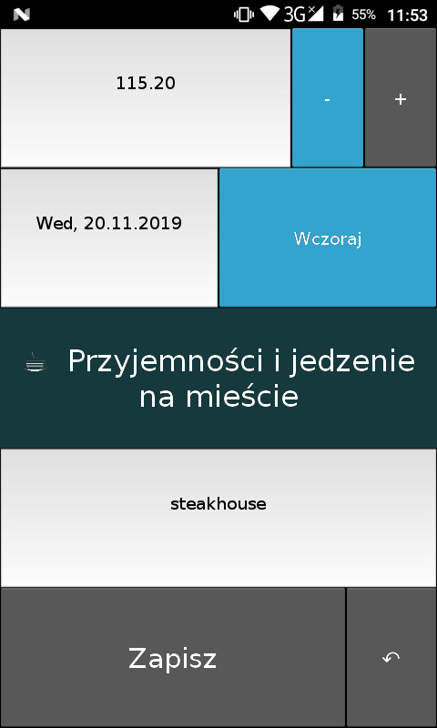
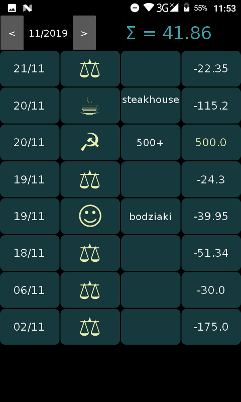
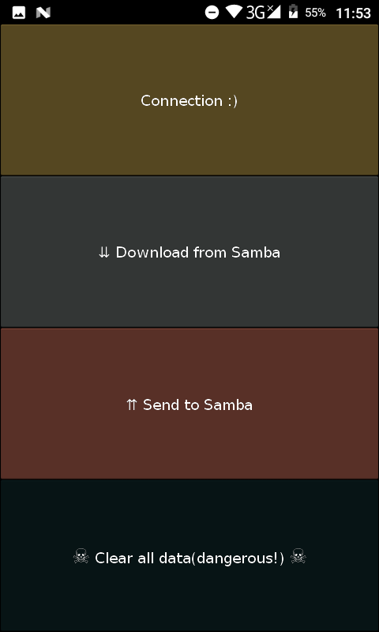

# :male_detective: InspectorBudget 

Screen 1    |     Screen 2   |    Screen 3  
:-----------:|:--------------:|:-------------:
  |  |  |

1. dodawanie wydatków
2. śledzenie wydatków
2. synchronizacja danych pomiędzy domownikami przez router
3. wydatki wszystkich domowników z różnych urządzeń w jednym miejscu
4. wygodne przewijanie pomiędzy widokami.
